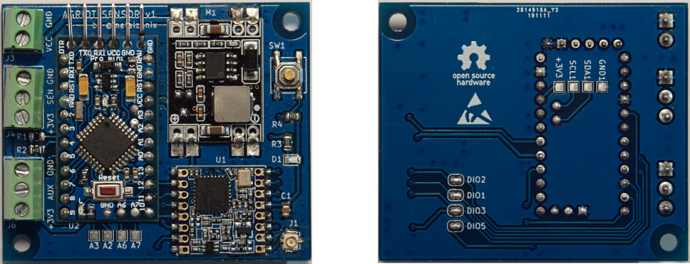
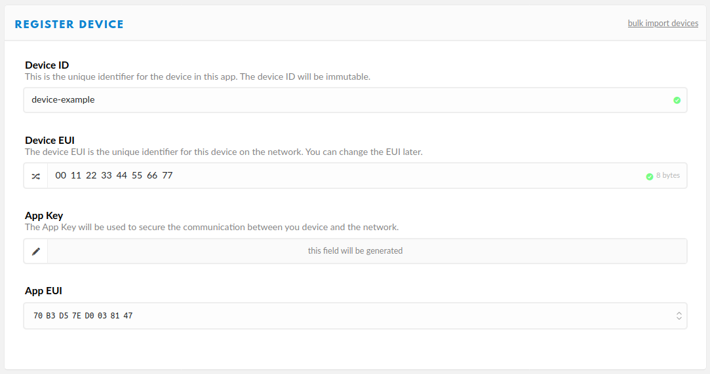
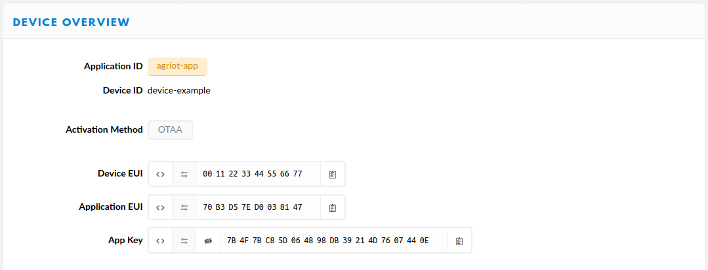
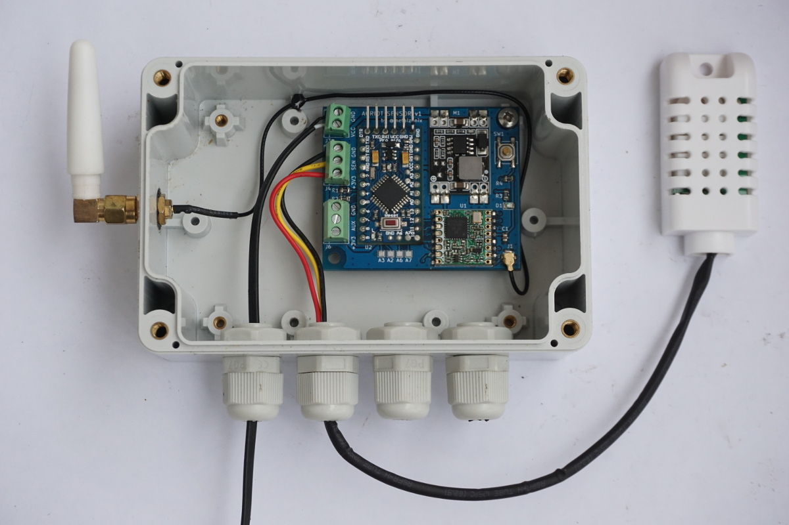
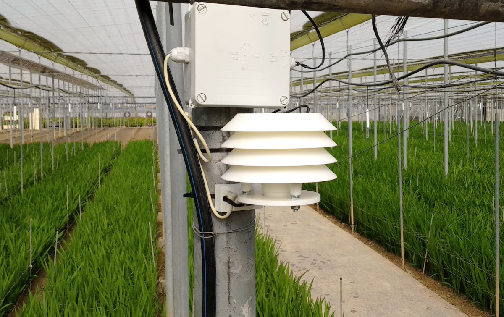

# AGRIOT LoraWAN sensor Node

[](https://travis-ci.com/AngelJMC/AGRIOT_lora-sensor-node)


## General info
The aim of this project is to provide an Open Source hardware/software platform for the rapid and low-cost development of LoRaWAN sensor nodes. It consists of an [Arduino Pro Mini][4] module, a LoRa [RMF95W][5] communications module, a Buck DC-DC converter and a few components to simplify connection to different sensors.




## Table of contents
- [AGRIOT LoraWAN sensor Node](#agriot-lorawan-sensor-node)
  - [General info](#general-info)
  - [Table of contents](#table-of-contents)
  - [Features](#features)
    - [Hardware](#hardware)
    - [LoRaWAN Features](#lorawan-features)
    - [List of supported sensors](#list-of-supported-sensors)
  - [Get the source code](#get-the-source-code)
    - [Directory Structure](#directory-structure)
  - [Firmware](#firmware)
    - [How to add new sensor support](#how-to-add-new-sensor-support)
  - [Command Line Interface](#command-line-interface)
    - [Commands](#commands)
  - [Connect your Device to LoRaWAN - The Things Network.](#connect-your-device-to-lorawan---the-things-network)
    - [Get your Device EUI](#get-your-device-eui)
    - [Activate your Device](#activate-your-device)
  - [Hardware](#hardware-1)
    - [PCB BOM](#pcb-bom)
  - [Node Examples](#node-examples)

## Features
### Hardware
 * 5-24v Power supply through a screw terminal block.
 * 2 GPIOS accessible from screw terminal blocks, one of them with interrupt.
 * 1 IC2 interface in the botton layer, with soldering pad.
 * 4 Analog inputs in the top layer, with soldering pad.
 * A switch to force the sending of LoRaWAN messages.
### LoRaWAN Features
* [OTAA activation][7]. It is not necessary to add the OTAA activation keys in the code. They are stored in the EEPROM and the configuration is done from the serial port. 
* [Adaptative Data Rate][6] according to the SNR of periodical downlink messages.
* Using [Arduino-LMIC lowpower library][8], a modified version of Arduino-LMIC to work with the low-power modes of the Atmega328P microcontroller.
### List of supported sensors
* DHT series of low-cost temperature/humidity sensors.
* DS18S20, DS18B20, DS1822 temperature sensor.
* GPS with NMEA Standar.
* ADC121 Analog-to-digital converter with I2C interface.
    
## Get the source code
Download repository and update submodules:

```
$ git clone https://github.com/AngelJMC/agriot-sensor-node.git
$ cd agriot-sensor-node
$ git submodule update --init --recursive
```


### Directory Structure

    .
    ├── docs          # Documentation files
    ├── firmware      # FW source code (Visual Studio Code)
    ├── hardware      # HW design files (Kicad)
    

## Firmware
If you want to modify the source code or program your devices, it is highly recommended to use [Visual Studio Code][2] and the [Platformio][3] plugin. Just open the "firmware" directory with Visual Studio Code and the whole project will be ready for use.
### How to add new sensor support

You must create a new .cpp file in which you implement the communication routines with the sensor. If you use the following scheme you will only have to add the communication with the sensor.  The sensors_update() function is executed periodically and once the sensor acquisition is finished the data is sent by the LoRaWAN communication layer.

~~~
#ifdef SENS_SENSORNAME
#include "protocol.h"
#include "sensors.h"
#include <CayenneLPP.h>

/* Schedule sensore measurement every this senconds */
#define SENSOR_INTERVAL (5*60) //seconds

static osjob_t sensjob;
CayenneLPP lpp(51);


static void sensors_update( osjob_t* j ) {
    os_avoidSleep();

    /*TO-BE Implemented -- Read sensor*/
    float t = readYourSensor();

    /* Update Data Frame using Cayennne Library */
    lpp.reset();
    lpp.addTemperature(1, t); /*Change according your sensor*/
    protocol_updateDataFrame( lpp.getBuffer(), lpp.getSize() );
    

    /* Schedule next sensor reading*/
    os_setTimedCallback( &sensjob, os_getTime() + sec2osticks(SENSOR_INTERVAL), sensors_update );
    Serial.flush();
    os_acceptSleep();
}

void sensors_init( ) {

    /*TO-BE Implemented -- Init sensor*/
    initYourSensor();


    /*Schedule the first sensor reading*/
    os_setTimedCallback(&sensjob, os_getTime() + sec2osticks(10), sensors_update);
}

#endif

~~~

To compile the code for this new sensor, you will have to add to the platformio.ini configuration file a new [build environment][1].

~~~
[env:pro8MHzatmega328_SENSORNAME]
platform = atmelavr
board = pro8MHzatmega328
framework = arduino
build_flags = -DSENS_SENSORNAME
~~~

Now you will be able to select the build environment from the Visual Studio Code.

## Command Line Interface

The device configuration is done through the command line interface (CLI) implemented in the device.

First, connect your device to the Arduino Serial Monitor over USB. Since the Arduino Pro Mini does not have an on-board FTDI chip, you will need to use a USB-TTL adapter. Set the baud rate to 9600 and open the serial port to establish connection. IMPORTANT: To reduce the device power consumption, the serial interface is only available for 10 minutes after the device power-up.

### Commands

Command ID| Type   | Description 
:--------:|--------|:----------
  D       | R      |  DEVEUI -  Unique device identifier.
  E       | R/W    |  APPEUI -  Unique identifier of the application.    
  K       | R/W    |  APPKEY -  Used in OTAA to generate session keys. 


## Connect your Device to LoRaWAN - The Things Network.

To use the default Over The Air Activation (OTAA) you will need to register your device with its Device EUI

### Get your Device EUI

The Device EUI is a unique address provided by the Atmega328P microcontroller. To retrieve this, type in the serial console:

> D    


Go to The Things Network and open the application to which you wish to add a device and click register device.
        
  * For Device ID, choose a - for this application - unique ID of lower case, alphanumeric characters and nonconsecutive - and _.
  * For Device EUI, copy-paste the one you retrieved from your device.
  * Leave the App Key to be generated.
  * For App EUI, select the generated EUI from the list.




### Activate your Device

Now that we have registered the device, we can activate the connection from our device itself. Activation means that the device will use the generated App Key to negotiate session keys for further communication. 

Go to Device Overview and copy the 8-byte Application EUI. Now, you have to send the "E" command with the value obtained through the serial port of the device:

> E:70B3D57ED0038147

Repeat the same process to send the 16 byte Application key:

> K:7B4F7BC85D064898DB39214D7607440E

Now, restart the device and it will automatically register to the network.



Session keys are not stored in non-volatile memory so they are renegotiated each time the device is powered on. This behavior is not the most appropriate, and will be reviewed in future versions.

## Hardware

Getting the gerbers for PCB fabrication [here]([hardware/gerbers](https://github.com/AngelJMC/agriot-sensor-node/tree/master/hardware/gerbers)).


### PCB BOM

| Name  | Anmount | Description |
| ------------- | ------------- | ------------- |
| [Arduino Pro Mini][20]          | 1  | Pro Mini Armega328P 3,3V 8MHz|
| [RFM95W][21]                    | 1  | RFM95W 868-915MHz LoRa SX1276 transceiver |
| [DC-DC Buck][22]                | 1  | 3.3V Fixed output, Input 5v-24v |
| Resistor 2.2k                   | 1  | 2.2K SMD resistor 0805|
| Resistor 4.7k                   | 3  | 4.7K SMD resistor 0805|
| Capacitor 4.7 uF/6.3 v          | 1  | 4.7 uF SMD capacitor 0805 |
| SMD LED                       | 1  | LED SMD 0850 |
| [Switch DIP][3]                 | 1  | Switch 4 PIN Metal SMD  |
| [Screw Terminal 01x03][24]      | 2  | 3P - Pitch 3.5/3.96mm Screw PCB Terminal Block Connector |
| [Screw Terminal 01x02][24]      | 1  | 2P - Pitch 3.5/3.96mm Screw PCB Terminal Block Connector |
| [Connector U.FL-R-SMT ][25]     | 1  |  Connector U.FL-R-SMT |
| [Antenna 3dbi RP-SMA][26]       | 1  |  Antenna 3dbi RP-SMA Connector + 21cm SMA Male/u.FL Pigtail Cable |

[20]:https://es.aliexpress.com/item/32341751484.html?spm=a2g0s.9042311.0.0.274263c0KXTWNh
[21]:https://es.aliexpress.com/item/32811523237.html?spm=a2g0s.9042311.0.0.274263c0h3imgq
[22]:https://es.aliexpress.com/item/32742116421.html?spm=a2g0s.9042311.0.0.274263c0h3imgq
[23]:https://www.aliexpress.com/item/32989610390.html?spm=a2g0s.9042311.0.0.274263c02c3pDo
[24]:https://es.aliexpress.com/item/32868442939.html?spm=a2g0s.9042311.0.0.274263c0HmLjas
[25]:https://es.aliexpress.com/item/32833564737.html?spm=a2g0s.9042311.0.0.274263c0HmLjas
[26]:https://www.aliexpress.com/item/32977287261.html?spm=a2g0s.9042311.0.0.274263c0KXTWNh


## Node Examples




[1]: https://docs.platformio.org/en/latest/projectconf/section_env.html
[2]: https://code.visualstudio.com/
[3]: https://platformio.org/
[4]:https://learn.sparkfun.com/tutorials/using-the-arduino-pro-mini-33v/all.pdf
[5]:http://www.anarduino.com/docs/RFM95_96_97_98W.pdf
[6]:https://www.thethingsnetwork.org/docs/lorawan/adaptive-data-rate.html
[7]:https://www.thethingsnetwork.org/docs/devices/registration.html
[8]:https://github.com/AngelJMC/arduino-lmic-lowpower
